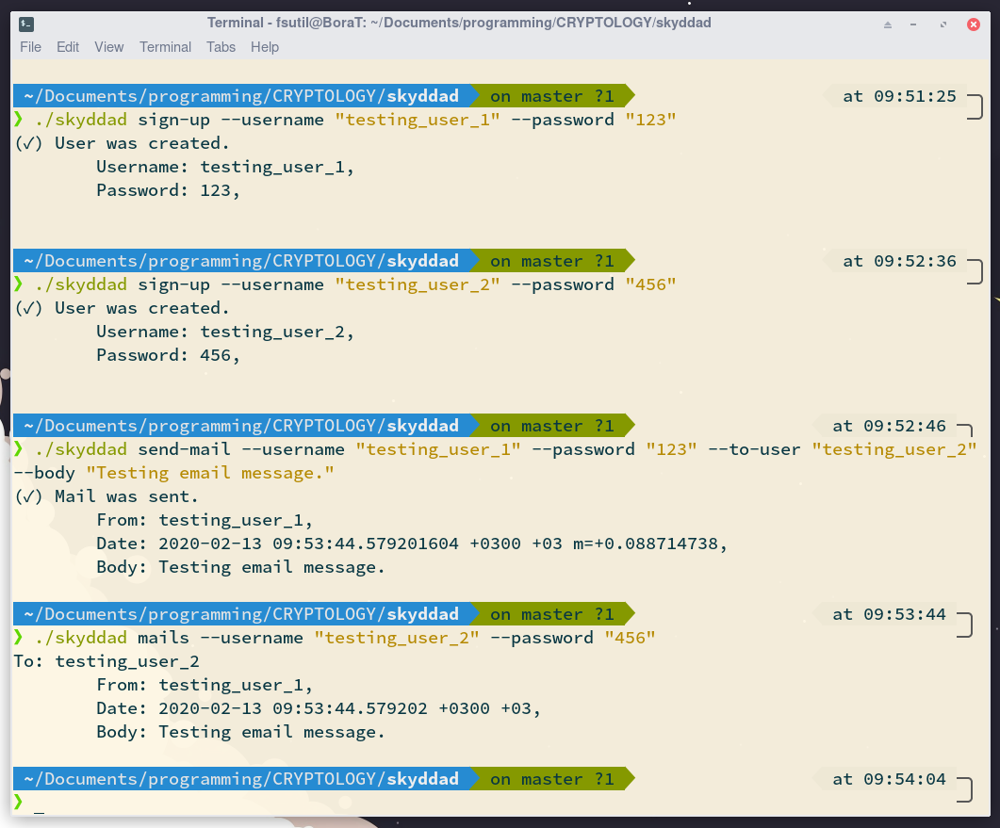

## Skyddad.

> It means "protected" in Swedish.

This program was written for Cryptology lesson that's given at Pamukkale University.

## Installation

> This project needs to Go (At least 1.13) to compile.  
  Download from [**here**](https://golang.org/dl/).

**Get the repo.**

```bash
go get github.com/boratanrikulu/skyddad
```

**Set your DB.**

This project needs Postgresql DB.  
You need to create a database named **skyddad**.

**Set your env file.**

You need to set database information to env file.  
Set `.env` file to wherever you use the skyddad command or `${HOME}/.config/skyddad/.env`

There is a env sample: [**here**](/env.sample).

## Usage

```
NAME:
   Skyddad - A mail client that keep you safe.

USAGE:
   skyddad [global options] command [command options] [arguments...]

COMMANDS:
   mails      Show all mails that is sent by the user.
   send-mail  Send mail to the user.
   sign-up    Sign up to use the mail mail service.
   help, h    Shows a list of commands or help for one command

GLOBAL OPTIONS:
   --help, -h  show help (default: false)
```

## Testing



## To-Do

- [ ] Add end-to-end encryption between users.
